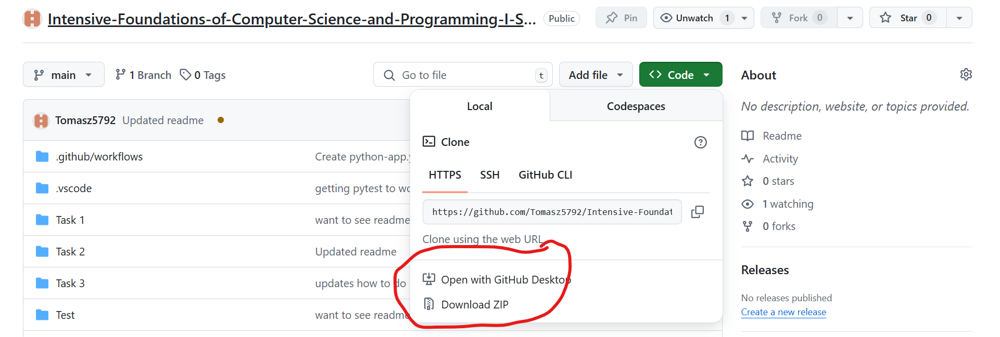
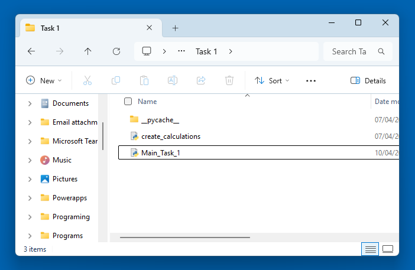
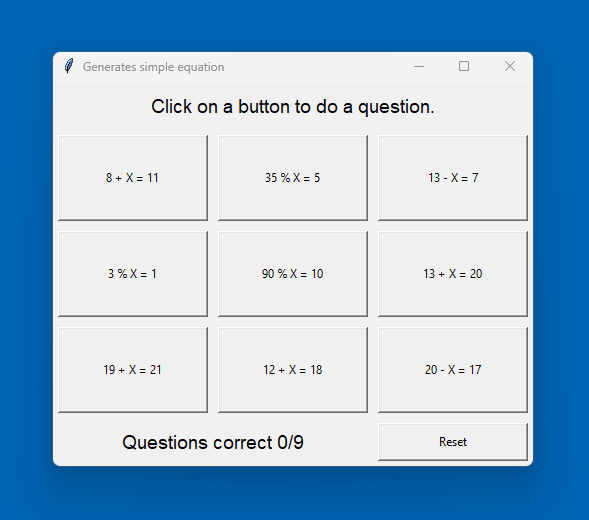
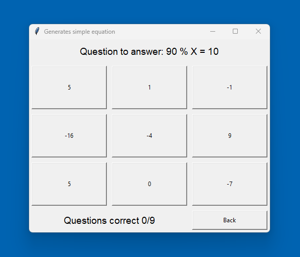

# Intensive-Foundations-of-Computer-Science-and-Programming-I-Summative-Assignment-1

# Simple Equation GUI Application
Code & Documentation for Simple Equation GUI Application. Created by Tomasz.

## Overview
The simple equation GUI application is a simple and interactive Tkinter GUI maths game designed to help users practice simple equations.  The app presents a grid of 9 questions that can be selected and gives 9 potential answers to choose from.  Instant feedback is given for the answers, and correct answers are tracked by the GUI.

<details closed><summary>User Documentation 🧑‍💻</summary>

---

## User Documentation
This is a simple equation GUI application used to practice simple maths.

### Features
The app contains the following features:
- Displays 9 simple equations.
- Each question has 9 possible choices.
- Click the question to open the answer screen.
- Question buttons update to labels when answered.
- The GUI tracks score
- There's a reset button to reset the questions and the score.

---

<details closed><summary>How to install the app 💻</summary>

### How to install the app

#### What you need
- A Python environment (3.7 or later) installed on your computer.  [Install Python](https://www.python.org/) Written with 3.12.9.
- git installed, unless the zip folder is downloaded from GitHub.  [Install Git](https://git-scm.com/)  [Install GitHub Desktop](https://github.com/apps/desktop)

### Instructions

1. Using the terminal, make sure Python is installed with:
```sh
python3 --version
```
Using the terminal, make sure git is installed with:
```sh
git --version
```
If either is not, please follow the instructions in the "What you need" section.

2. Download the app in your preferred way either by visiting [Link to GitHub Repo](https://github.com/Tomasz5792/Intensive-Foundations-of-Computer-Science-and-Programming-I-Summative-Assignment-1#) and downloading a zip file or using GitHub desktop:



 If you would like to use the powershell termanal, cd into the folder you want the repo saved and use this code:
```sh
git clone https://github.com/Tomasz5792/Intensive-Foundations-of-Computer-Science-and-Programming-I-Summative-Assignment-1.git
```
3. Go to the folder containing Main_Task1.py and double-click to run.  

</details>

---

### How to use the app
1. Install and open the app as detailed in the how to install the app section.
2. Click on a question to answer.



4. Click on an answer for the question.



6. Score will increase when questions are correctly answered.

---

</details>

<details closed><summary>Technical Documentation 🧑‍💼</summary>


## Technical Documentation


### Modules Used

<details closed><summary>tkinter</summary>
- tkinter is included with Python as standard.
- [Documentation for tkinter](https://docs.python.org/3/library/tkinter.html)
</details>

<details closed><summary>custom module create_calculations.py</summary>

#### create_calculations.py functions
#### create_questions()
Used to create a dictionary of questions and answers for use in the GUI.

#### create_answer(i: int, answer: int, x: int, is_correct_answer: bool=False)
Called from create_questions() and is used to create correct and incorrect answers for each question.

</details>

---

### Main functions

#### create_gui_questions(questions: dict, questions_correct: int)
Creates the GUI question layout.  It is a 3 x 3 grid of math question buttons.  When questions are answered, the button is replaced by a guestion label which displays if the answer was correct or not.  There is also a reset button to reset the questions and score and a label to display the score.  It requires the questions dictionary and the questions correct integer to be passed to it.

#### create_gui_answer(questions: dict, int_question_selected: int, questions_correct: int)
Clone of the create_gui_questions function but creates an answer gui with 9 answers for the user to select.  Also has a back button.  In addition to the create_gui_questions function it also requires the question selected to be passed to it.

---

### gui component functions

#### create_label(row: int, columnspan: int=3, text: str="Error")
Creates a label for the title and questions answered box.

#### create_label_question(row: int, column: int, text: str="Error")
Creates the label to replace the button when the question is answered, used on the question screen.

#### create_button(row: int, column: int, int_question_selected: int=0, button_number: int=0, width: int=20, height: int=5, text: str="Error", button_type: str="calculation")
Creates the button used on both GUI screens for questions and answers.

---

### Event handling functions

| Function Name                                 | Description                                                                                                                                       |
|----------------------------------------------|---------------------------------------------------------------------------------------------------------------------------------------------------|
| handle_button_press(event, row, column, button_number) | Used to test if the app is working by recording which button is pressed.                                                                             |
| handle_button_press_select_question(event, button_number) | Handles events when a question button is pressed. Calls the answer GUI to be created and passes in the question selected.                         |
| handle_button_press_select_answer(event, button_number, int_question_selected) | Handles events when an answer button is pressed. Updates the answer selected and evaluates if it is correct. If correct, update the score. Then, it calls the question GUI to be re-created. |
| handle_button_press_reset(event)            | Resets the questions and the score.                                                                                                               |
| handle_button_press_back(event)             | Returns the user to the question GUI so they can select another question.                                                                         |

---

### Utility functions

#### clear_root()
Destroys the current GUI for use when creating a new one so they don't overlap.

---

### Global Variables

#### root
The tkinter object to which all the tkinter components are added to.

#### questions_correct
An integer to store the questions that the user has got correct.

#### questions
A dictionary to store the questions and answers that make the game work.

---

</details>
<details closed><summary>Future Plans 🔐</summary>

## Future Plans
- Move the code for the GUI out of main and into a GUI module.
- Stop using global variables.  As this is critical to testing and scalability.
- Write some tests.
- Add error handling.
- Stop the terminal coming up when the GUI opens.

---

</details>
